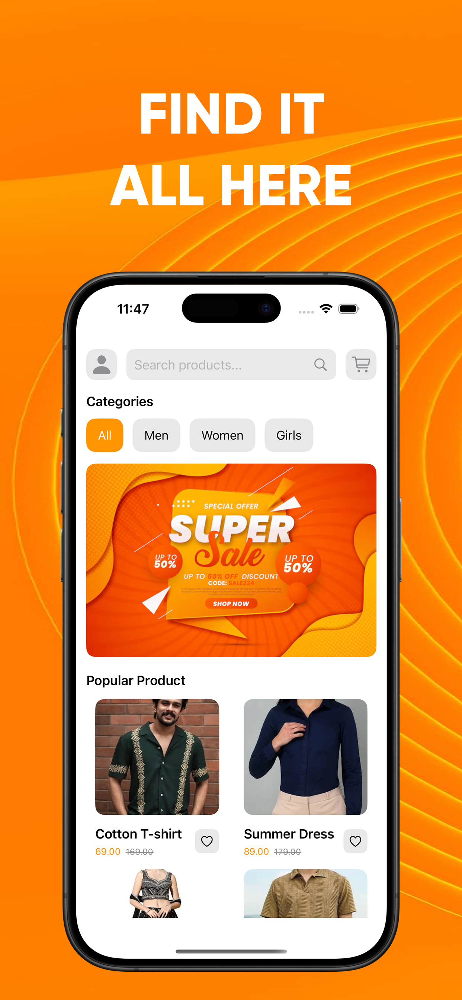
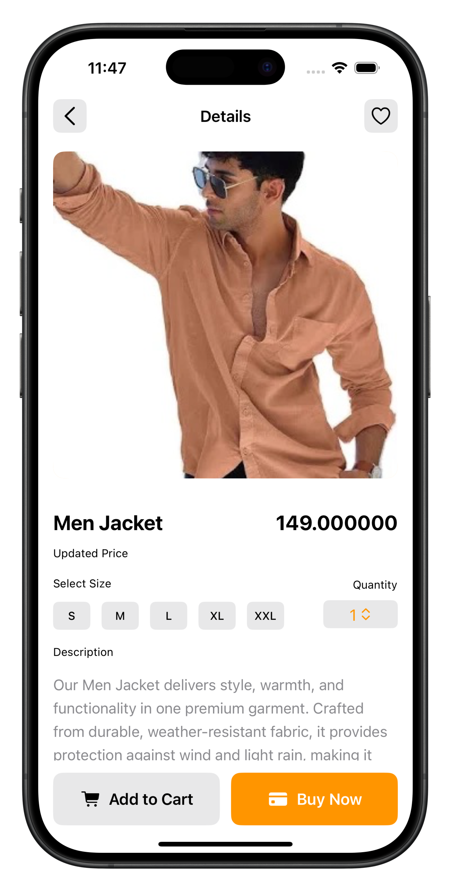
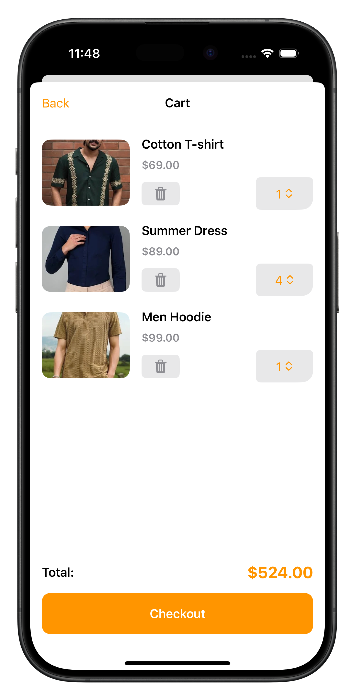

# Bazzar - Local Market Shopping App

Bazzar is an iOS shopping app designed to provide users with a seamless local marketplace experience. Users can browse products, manage their cart and wishlist, save multiple delivery addresses, and perform secure payments with Google or Apple sign-in.

---

## Features
- Browse products by category with rich images and details.
- Add products to cart and wishlist.
- Manage cart: change quantity, remove items, and view total.
- Save multiple delivery addresses and select an address during checkout.
- Secure payments via Razorpay with Google Pay or Apple Pay.
- User authentication with Google and Apple sign-in (no username/password required).
- Delete account option with proper reauthentication flow for data privacy compliance.
- Offline caching of product data using SwiftData for faster load times.
- Animated and intuitive UI for a smooth shopping experience.

---

## Screenshots

| Home Screen | Product Page | Cart |
|------------|--------------|------|
|  |  |  |


---

## Tech Stack
- **Frontend:** SwiftUI, SwiftData
- **Backend & Database:** Firebase Firestore, FirebaseAuth
- **Payments:** Razorpay SDK
- **Authentication:** Google Sign-In, Sign in with Apple
- **Notifications:** Local notifications for offers and updates

---

## Installation
1. Clone this repository:
```bash
git clone https://github.com/yourusername/bazzar-ios.git
